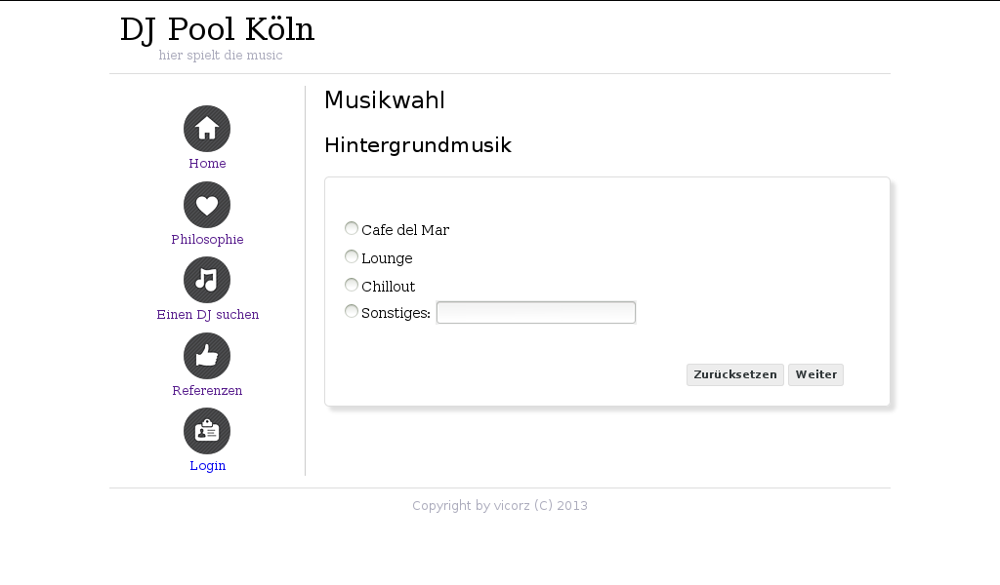

WishMe Music
======

Web based DJ contact Form  

**Currently under development**

WishMeMusic is a small web based dashboard using Ruby's sinatra library as application middleware. 

Dependencies
------------

###Libraries

Install the following libs beforehead (packet names for Fedora 18):
* postgresql-devel (for production environment)
* sqlite-devel
* readline-devel
* openssl-devel
* zlib-devel

Installation
------------

0. install development libraries above for native gems
1. install bundler gem
2. clone git repository
3. bundle install the gems for the app
4. execute the db migration
5. start the app 


###1. Install the bundler gem

Install the bundler gem with `gem install bundler`

The Ruby gems used are listed in the Gemfile. You can use the bundler gem to install them automaticly. If you have the **bundler** installed the next step after downloading the source is a call of `bundle install` in the source directory.

###2. Download the application

Let's Make a local copy of the source tree of the application with git:

```
git clone git://github.com/rheikvaneyck/WishMeMusic.git
```

###3. bundle install the gems for the app

Install the gems by `bundle install`

The gems the app needs depend on the application environment. During Development and testing the productiv gems aren't needed. So install only the development gems with `bundle --without production`. Thus, the app depends on sqlite3 and will use this local database file. 


###4. Create the database

Now we have to import the data in the database. But first we need one. You create that database and the necessary tables with ruby's **rake** tool:

```
rake db:migrate
```

All available rake tasks can be shown with the `rake -T` command.


###5. Run the application

The application can be started with `rake web:run`. The web application listens on http://localhost:4567/


Usefull for Development
-------------------

###Create a migration file

A little script helps to create migration files. It takes a file with the describtion of the table columns and generates the unique migration files from that. Just create a description file, e.g. scheme_description_goal.yml, in the config/ directory with the name for the column as the last part of the filename and the type of date like that:

```
zeit: time
goals: integer
```

A call of `rake db:create_migration_file['scheme_description_goal.yml']` generates a migration file from which the `rake db:migrate` creates, edits or deletes tables in the database.

Screenshot
----------




License
-------

(The GPL)

Copyright (c) 2013 Viktor Rzesanke

lola is copyrighted free software by Viktor Rzesanke.
You can redistribute it and/or modify it under either the terms of the GPL
(see LICENSE file).

The above copyright notice and this permission notice shall be
included in all copies or substantial portions of the Software.

THE SOFTWARE IS PROVIDED 'AS IS', WITHOUT WARRANTY OF ANY KIND,
EXPRESS OR IMPLIED, INCLUDING BUT NOT LIMITED TO THE WARRANTIES OF
MERCHANTABILITY, FITNESS FOR A PARTICULAR PURPOSE AND NONINFRINGEMENT.
IN NO EVENT SHALL THE AUTHORS OR COPYRIGHT HOLDERS BE LIABLE FOR ANY
CLAIM, DAMAGES OR OTHER LIABILITY, WHETHER IN AN ACTION OF CONTRACT,
TORT OR OTHERWISE, ARISING FROM, OUT OF OR IN CONNECTION WITH THE
SOFTWARE OR THE USE OR OTHER DEALINGS IN THE SOFTWARE.
