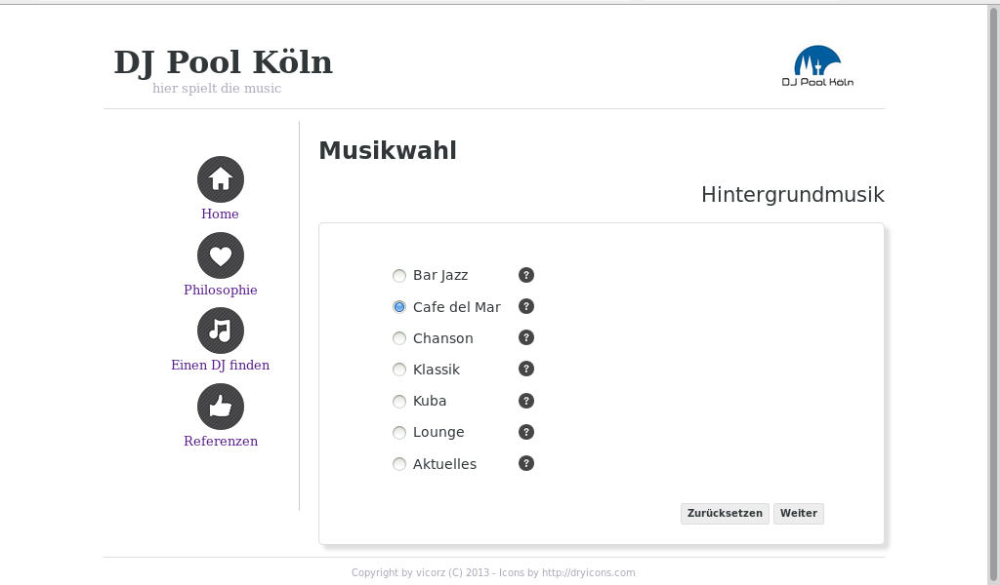

WishMeMusic
===========

Web based DJ contact Form  

**Currently under development**

WishMeMusic is a small web based dashboard using Ruby's sinatra library as application middleware. 

take a look on the [wiki](https://github.com/rheikvaneyck/WishMeMusic/wiki) how to get the [source](https://github.com/rheikvaneyck/WishMeMusic/wiki/Installation#get-the-source), for [installation](https://github.com/rheikvaneyck/WishMeMusic/wiki/Installation), and further information.

Screenshot
----------

Dependencies
------------

* mysql-Server
* Web-Server (e.g. nginx, apache)
* memcache

License
-------

(The GPL)

Copyright (c) 2013 Viktor Rzesanke

lola is copyrighted free software by Viktor Rzesanke.
You can redistribute it and/or modify it under either the terms of the GPL
(see LICENSE file).

The above copyright notice and this permission notice shall be
included in all copies or substantial portions of the Software.

THE SOFTWARE IS PROVIDED 'AS IS', WITHOUT WARRANTY OF ANY KIND,
EXPRESS OR IMPLIED, INCLUDING BUT NOT LIMITED TO THE WARRANTIES OF
MERCHANTABILITY, FITNESS FOR A PARTICULAR PURPOSE AND NONINFRINGEMENT.
IN NO EVENT SHALL THE AUTHORS OR COPYRIGHT HOLDERS BE LIABLE FOR ANY
CLAIM, DAMAGES OR OTHER LIABILITY, WHETHER IN AN ACTION OF CONTRACT,
TORT OR OTHERWISE, ARISING FROM, OUT OF OR IN CONNECTION WITH THE
SOFTWARE OR THE USE OR OTHER DEALINGS IN THE SOFTWARE.
